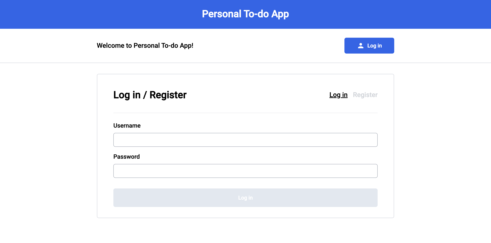

# Personal To Do List App

---

## Table of Content

- [Personal To Do List App](#personal-to-do-list-app)
  - [Table of Content](#table-of-content)
  - [Overview](#overview)
  - [Basic Usage](#basic-usage)
  - [Documentation](#documentation)
  - [Build with](#build-with)

## Overview

## Basic Usage

## Documentation

- [Infrastructure Description](docs/Infrastructure_description.md)
- [Pipeline Description](docs/Pipeline_description.md)
- [Application Dependencies](docs/Application_dependencies.md)

## Build with

- [Angular](https://angular.io/) - Single Page Application Framework
- [Node](https://nodejs.org) - Javascript Runtime
- [Express](https://expressjs.com/) - Javascript API Framework
- [Serverless](https://www.serverless.com/) - A Deployment Service to AWS Lambda
- [Prisma](https://www.prisma.io/) - An Open Source ORM with Typescript
