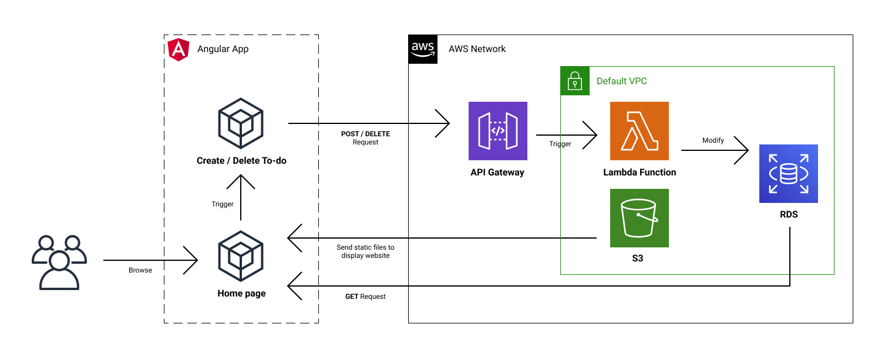

# Infrastructure Description

- [Infrastructure Description](#infrastructure-description)
  - [**Architecturce Diagram**](#architecturce-diagram)
  - [**Concepts**](#concepts)
    - [1. Frontend](#1-frontend)
    - [2. Backend](#2-backend)
    - [3. Database](#3-database)

## **Architecturce Diagram**



## **Concepts**

**AWS Cloud Services** and also **Angular App Interface** are main two parts in the user flow of this to-do app. I will breakdown the whole infrastructure into the following **3** parts and elaborate :

### 1. Frontend

This app is a single page application.

**Angular** was used as a JS frontend framework in this project. With powerful Angular CLI, we can run `ng build` to generate a production-ready output folder and upload it to _AWS S3 bucket_ as a static website hosting.

Please note that the S3 bucket and also `index.html` should be set as **Publilc accessable**. Users can enter the url which is auto-generated by S3 to start using the app.

### 2. Backend

**Lambda function** and **Express JS** are the key to our APIs. With **Serverless framework**, we can build RESTful APIs on Lambda with only few clicks, which provides us a chance to replace **AWS Elastic Beanstalk** which is backed by EC2.

An **API Gateway** and also a **S3 Bucket** will be generated by Serverless framework and link to our main Lambda function to make this RESTful APIs happened. Plus, Express can let us build a server with few lines.

By conbining these powerful features, it provides this to-do list app the fundamentals to handle complicated logics behind the sense, which I will call this the **backbone** of this app.

### 3. Database

**AWS RDS** which is a relational database service was used in this app. The table schema is listed below.

```sh
model User {
  id        Int      @default(autoincrement()) @unique
  username  String   @db.VarChar(50) @unique
  email     String   @db.VarChar(50)
  password  String
  createdAt DateTime @default(now())
  todos     Todo[]
}

model Todo {
  id     Int    @unique @default(autoincrement())
  title  String
  task   String @db.Text
  user   User   @relation(references: [id], fields: [usr_id])
  usr_id Int
  isFinished Boolean @default(false)
  createdAt DateTime @default(now())
}

```

`Prisma` was used as a bridge between our Express server and AWS RDS. When our Lambda function is triggered by someone sending `POST` or `DELETE` requests to our API Gateway, through Prisma, our server can send some SQL logic to our database and modify the data set inside.

And then our Angular app inside S3 bucket will be display in the browser to users.
