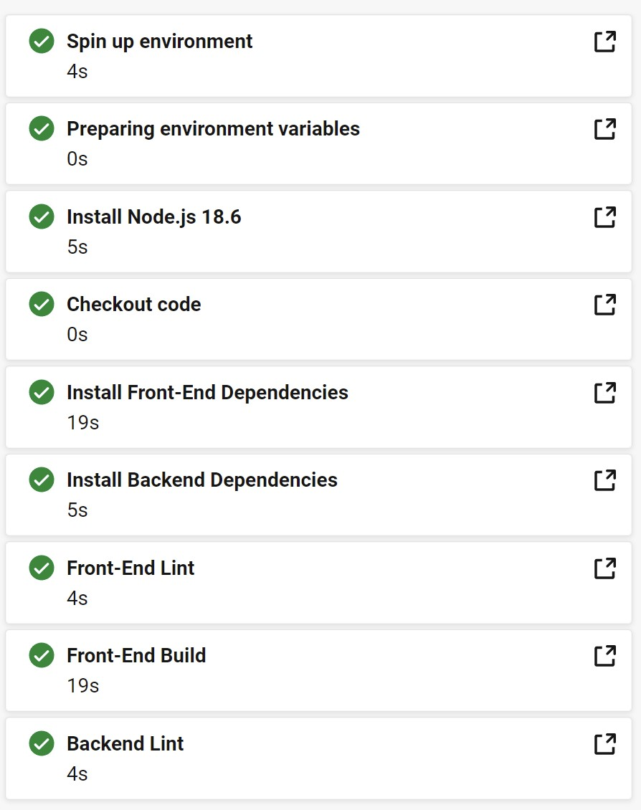
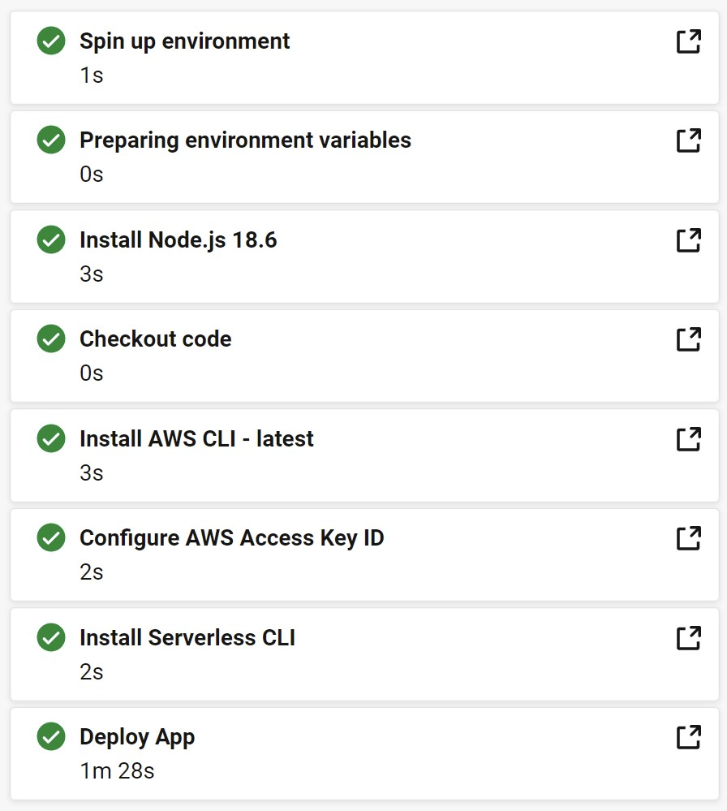

# Pipeline Description

This project pipeline is built with [Circle CI](https://circleci.com/). With configuration in `.circleci/config.yml`, Circle CI will handle all the steps we need for deployment. This makes the process go automacially with checking to make sure this app is error-free.

## **Overview**

| Build                                 | Deploy                                  |
| ------------------------------------- | --------------------------------------- |
|  |  |

## **Pipeline Steps**

### 1. Build Phase

For the first part of the 'Build' process, we will take **orbs** (provided by Circle CI) as executors to simplify the flow. Orbs help us set up a docker container with `Node.js 18.6` to do all the checkings with `Eslint` and then simulate the package installation and building process.

If the whole process is error-free, the code will be passed to the next phase and we can sure this app will build smoothly in the coming deployment process. If not, Circle CI provides us a wonderful interface to debug and understand the problem by checking the logs.

### 2. Deploy Phase

`Contexts` in Circle Ci needs to be set before we enter the deploy phase. With credentials stored in the contexts, we can pass them to our docker container in this stage as environment variables. The deployment process will fail if we don't provide the context.

In this phase, another docker container will be built and execute:

1. Node.js Setup
2. Package Installation
3. AWS Credentials Set Up
4. Serverless CLI installation
5. Build both api and frontend code
6. Push to AWS S3 and Lambda function

If all the credemtials are set correctly, there should be no any error in this part.
