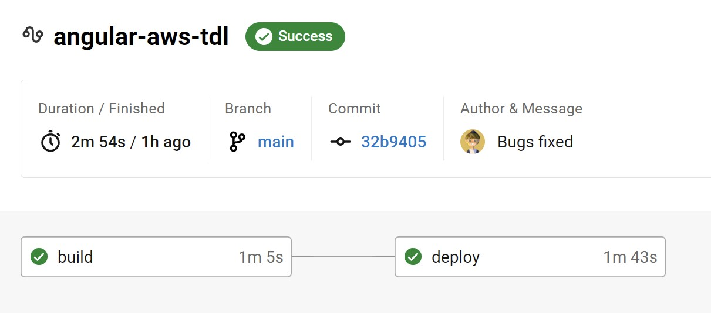
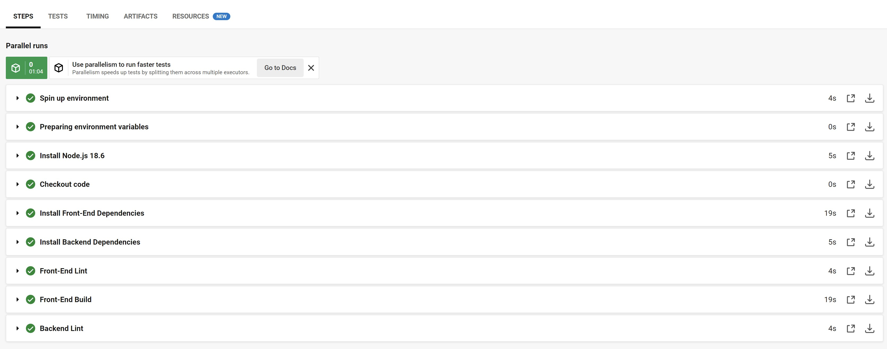
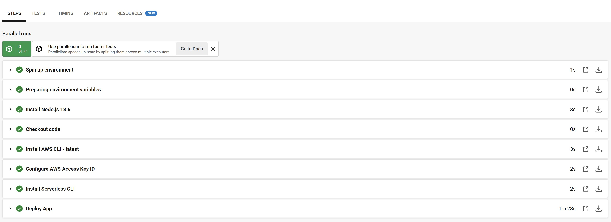
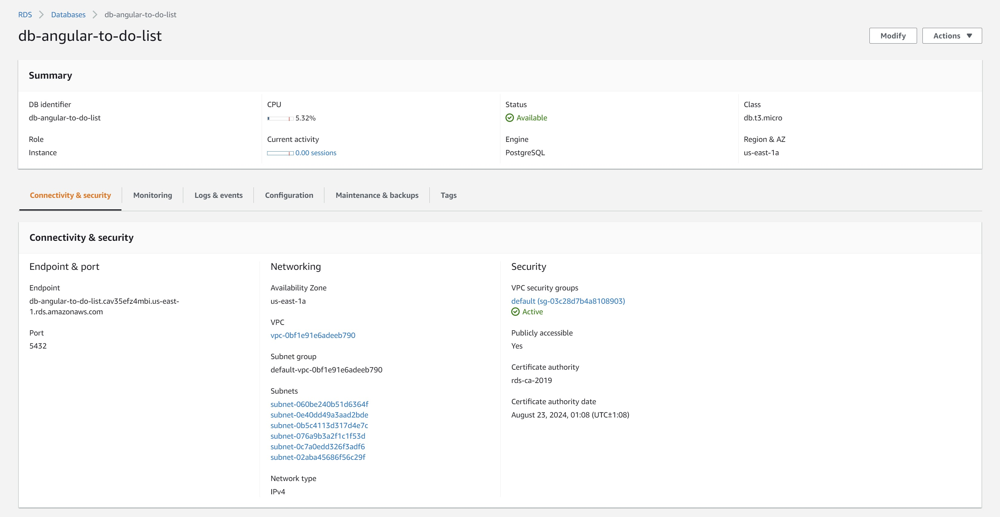
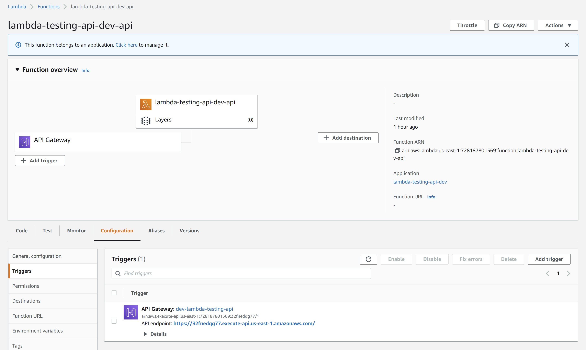
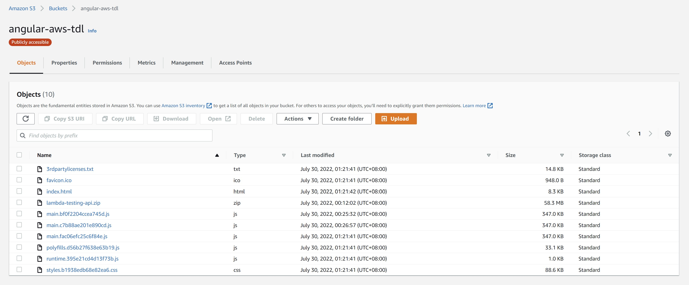

# Screenshots of Successful Building

- [Screenshots of Successful Building](#screenshots-of-successful-building)
- [CircleCi build](#circleci-build)
  - [Build Phase](#build-phase)
  - [Deploy Phase](#deploy-phase)
- [AWS](#aws)
  - [AWS RDS for the database overview](#aws-rds-for-the-database-overview)
  - [AWS Lambda Function for the (backend) API deployment](#aws-lambda-function-for-the-backend-api-deployment)
  - [AWS S3 for (frontend) web hosting](#aws-s3-for-frontend-web-hosting)

# CircleCi build

## Build Phase

## Deploy Phase

# AWS

## AWS RDS for the database overview

## AWS Lambda Function for the (backend) API deployment

## AWS S3 for (frontend) web hosting

